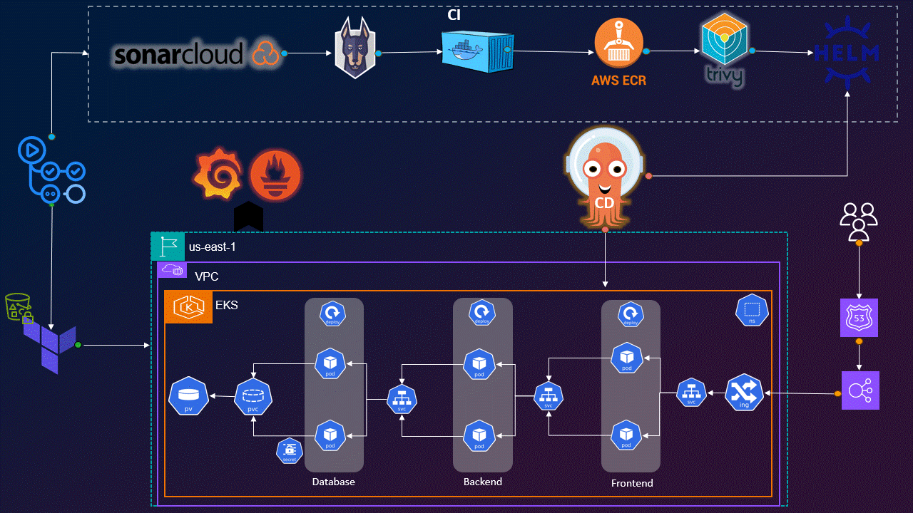

# DevSecOps Three-Tier Application with ArgoCD on AWS EKS

A complete DevSecOps pipeline for deploying a three-tier quiz application on AWS using Kubernetes (EKS), Terraform for infrastructure provisioning, and ArgoCD for GitOps. This project demonstrates infrastructure as code, application deployment, security scanning, and comprehensive monitoring.



## 🏗️ Architecture Overview

### Infrastructure Layer (Terraform)
- **AWS EKS Cluster**: Managed Kubernetes service 
- **VPC Configuration**: Custom VPC with CIDR 
- **IAM Roles**: Secure permissions for EKS cluster and worker nodes
- **Application Load Balancer**: Ingress traffic management

### Application Layer
- **Frontend**: React.js quiz application
- **Backend**: Node.js API server
- **Database**: MongoDB for data persistence
- **Container Registry**: AWS ECR for image storage

### DevSecOps Pipeline
- **CI/CD**: GitHub Actions workflows
- **Security Scanning**: Snyk, Trivy, SonarCloud integration
- **GitOps**: ArgoCD for declarative deployments
- **Monitoring**: Prometheus and Grafana stack

## 🛠️ Prerequisites

Before starting, ensure you have the following tools installed:

- AWS CLI
- kubectl
- Helm
- Terraform

## 🚀 Getting Started

### 1. Repository Setup

```bash
# Clone the repository
git clone https://github.com/omar99elnemr/DevSecOps-CI-CD-Pipline-using-Github-Actions-and-ArgoCD-with-monitoring.git
cd DevSecOps-CI-CD-Pipline-using-Github-Actions-and-ArgoCD-with-monitoring

# Change origin to your own repository
git remote set-url origin <your-repo-url>
git push -u origin main
```

### 2. Create S3 Bucket for Terraform State

Create an S3 bucket for storing Terraform remote state:

**Option A: Using AWS CLI**
```bash
BUCKET_NAME="quizapp00tfstate00bucket"
aws s3api create-bucket \
    --bucket "$BUCKET_NAME" \
    --region us-east-1

# Optional: Enable versioning
aws s3api put-bucket-versioning \
    --bucket "$BUCKET_NAME" \
    --versioning-configuration Status=Enabled
```

**Option B: Using AWS Console**
Navigate to S3 service and create a bucket manually.


## 🔐 Secrets Configuration

### Required GitHub Secrets

| Secret Name | Description |
|-------------|-------------|
| `AWS_ACCESS_KEY_ID` | AWS access key for ECR and Terraform |
| `AWS_SECRET_ACCESS_KEY` | AWS secret key for ECR and Terraform |
| `AWS_ACCOUNT_ID` | Your AWS account ID (for ECR registry URL) |
| `BUCKET_TF_STATE` | S3 bucket name for storing Terraform state |
| `SNYK_TOKEN` | Snyk authentication token for vulnerability scanning |
| `SONAR_TOKEN` | SonarCloud authentication token |
| `SONAR_ORGANIZATION` | Your SonarCloud organization name |
| `SONAR_PROJECT_KEY` | SonarCloud project key |
| `SONAR_URL` | SonarCloud URL (usually https://sonarcloud.io) |

### Setup Instructions

#### AWS Credentials
1. Create IAM user with Admin policy attached
2. Generate access keys from Security Credentials tab
3. Note down your AWS Account ID (top-right corner of AWS Console)


<br><br>


<br>


#### Snyk Token
1. Sign up at [Snyk](https://snyk.io)
2. Go to Account Settings → General → Auth Token
3. Copy the token


<br>


#### SonarCloud Setup
1. Sign up at [SonarCloud](https://sonarcloud.io)
2. Create new organization manually
3. Create new project and select "Previous version"
4. Choose "GitHub Actions" as analysis method
5. Copy the provided token and organization details


<br>


<br>


<br>


<br>


<br>


<br>


#### Adding Secrets to GitHub
1. Navigate to your repository
2. Go to Settings → Secrets and Variables → Actions
3. Add all required secrets listed above


## 📋 Deployment Steps

### Step 1: Infrastructure Deployment
1. Review and modify Terraform variables and Helm values as needed
2. Run the `terraform.yaml` workflow from GitHub Actions
3. Wait for completion and note the cluster access details from workflow output


### Step 2: Monitoring Setup

#### Prometheus
Access Prometheus using the external IP provided in the workflow output.


#### Grafana
- **Default Credentials**: Check workflow output for username/password

- **Dashboard Import**: Use ID `6417` for Kubernetes monitoring


- **Additional Dashboard IDs**:
  - Global View: `15757`
  
  - Namespaces: `15758` 
  
  - Nodes: `15759`
  

### Step 3: ArgoCD Configuration

#### Initial Setup
```bash
# Get ArgoCD initial password
export ARGO_PWD=$(kubectl -n argocd get secret argocd-initial-admin-secret -o jsonpath="{.data.password}" | base64 -d)
echo $ARGO_PWD
```

#### Repository Configuration
- Login to ArgoCD with username `admin` and the retrieved password


#### Application Creation
1. Click "CREATE APPLICATION"

2. Configure application details:
   - **Application Name**: Choose a meaningful name
   - **Project**: default
   - **Sync Policy**: Manual or Automatic
   - **Repository URL**: Your application repository
   - **Path**: Path to Helm charts
   - **Cluster URL**: https://kubernetes.default.svc
   - **Namespace**: Target namespace


<br>


### Step 4: Application Deployment
1. Navigate to GitHub Actions in your repository
2. Run the "DevSecOps CI" workflow
3. This workflow will:
   - Scan code for vulnerabilities
   - Build and scan Docker images
   - Push images to ECR
   - Update Helm values with new image tags
   - Trigger ArgoCD sync for deployment


<br>


<br>


<br>


### Step 5: Domain Configuration (Optional)

#### Route 53 Setup
1. Purchase domain from provider (e.g., Namecheap, GoDaddy)

2. Create hosted zone in Route 53


<br>


<br>


3. Update nameservers at your domain provider

4. Create A-record pointing to ALB DNS name


## Working app


## 🧹 Cleanup

To destroy all resources:

1. Run the `terraform-destroy.yml` workflow from **GitHub Actions**.  
   

2. If the cleanup workflow gets stuck, use the following order to manually destroy AWS resources:  
   - **EKS Node Groups** → **EKS Cluster** → **VPC** *(must be in this exact order)*  
   - Policies, IAM Roles, and ECR repositories can be deleted in any order.  

3. Verify that all AWS resources have been properly removed.

**Note**: Ensure all secrets are properly configured before running any workflows. The deployment process may take 15-30 minutes depending on your AWS region and resource allocation.


