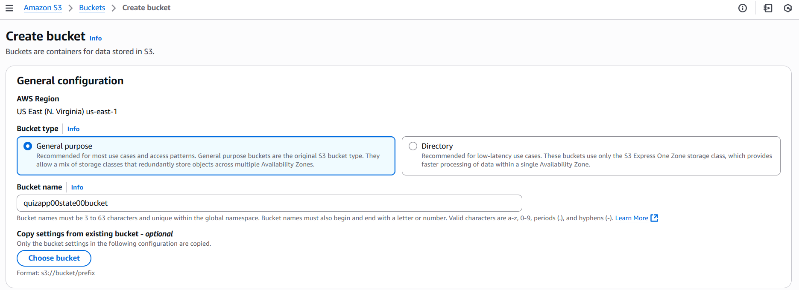

To use this repo
first clone it 
change the origin to your own repo
then push it

you then recommended to havve the following tools on your machine
1- awscli
2- kubectl
3- helm
2- terraform

you need to create a S3 bucket for the remote state of terraform
eaither through console or through the cli
and note down the bucket name


For CLI make sure you 
Here are  Required GitHub Secrets:
AWS_ACCESS_KEY_ID           # AWS access key for ECR and Terraform
AWS_SECRET_ACCESS_KEY       # AWS secret key for ECR and Terraform  
AWS_ACCOUNT_ID              # Your AWS account ID (for ECR registry URL)
BUCKET_TF_STATE            # S3 bucket name for storing Terraform state
SNYK_TOKEN                 # Snyk authentication token for vulnerability scanning
SONAR_TOKEN               # SonarCloud authentication token
SONAR_ORGANIZATION        # Your SonarCloud organization name
SONAR_PROJECT_KEY         # SonarCloud project key
SONAR_URL                 # SonarCloud URL (usually https://sonarcloud.io)
GITHUB_TOKEN              # Automatically provided by GitHub Actions

Create IAM user With admin attached policy.
Take use access keys you get under access tab save them for use.
AWS_ACCESS_KEY_ID           # AWS access key for ECR and Terraform
AWS_SECRET_ACCESS_KEY       # AWS secret key for ECR and Terraform  
Also copy your Acount ID you can find it on the to right  of console
AWS_ACCOUNT_ID              # Your AWS account ID (for ECR registry URL)

Next Is the Terraform state bucket on s3:
You can either create it using console.
or after configuring your awscli with IAM access keys, you can use this command:

```
BUCKET_NAME="quizapp00tfstate00bucket"
aws s3api create-bucket \
    --bucket "$BUCKET_NAME" \
    --region us-east-1

#oprional
aws s3api put-bucket-versioning \
    --bucket "$BUCKET_NAME" \
    --versioning-configuration Status=Enabled
```

then use the name of created bucket as secret
BUCKET_TF_STATE            # S3 bucket name for storing Terraform state


First run the IaC workflow
It will provision 2 ecr repos Frontend image and backend Image
An EKS cluster with ArgoCD, Prometheus, Grafana and AWS loadbalancer Controller installed through helm provider. Also patched The monitoring stack to have a loadblancer service type.



## Resource Management & Cost Control

### AWS Resource Group (Similar to Azure Resource Groups)
This project creates **one comprehensive AWS Resource Group** to organize and manage all resources:

**Resource Group**: `{cluster-name}-infrastructure` - Contains ALL provisioned resources

### How to View Your Resources:
```bash
# View all resources in your infrastructure group
aws resource-groups list-group-resources --group-name {cluster-name}-infrastructure

# View resources in AWS Console
# Go to: AWS Console > Resource Groups > Saved Groups > {cluster-name}-infrastructure
```

### How to Destroy All Resources:

#### Option 1: Terraform Destroy (Recommended)
```bash
cd terraform/
terraform destroy
# Type 'yes' when prompted
```

#### Option 2: AWS Console Resource Groups
1. Go to AWS Console > Resource Groups
2. Select your resource group: `{cluster-name}-infrastructure`
3. View all resources and manually delete them
4. **Note**: This is more complex and may miss some resources

#### Option 3: AWS CLI with Resource Groups
```bash
# List all resources first
aws resource-groups list-group-resources --group-name {cluster-name}-infrastructure

# Delete resources individually (complex, not recommended)
```

### Cost Monitoring:
- Use AWS Cost Explorer with tag filter: `Project=DevSecOps-CI-CD-Pipeline`
- Monitor costs by resource groups in AWS Console
- Set up billing alerts for your project tag

### Cost Optimizations Applied:
- ✅ No NAT Gateway (~$45/month saved)
- ✅ Public subnets only with security groups
- ✅ Disabled EKS CloudWatch logging (~$10-20/month saved)
- ✅ Disabled AlertManager (~$5-10/month saved)
- ✅ Simplified monitoring configuration
- ✅ **Total estimated savings: $60-80/month**

## S3 Bucket for Terraform State:
```
aws s3api create-bucket \
  --bucket quizapp00state00bucket \
  --region us-east-1 \
 #if not us-east-1
 # --create-bucket-configuration LocationConstraint=<your-region> 
```
